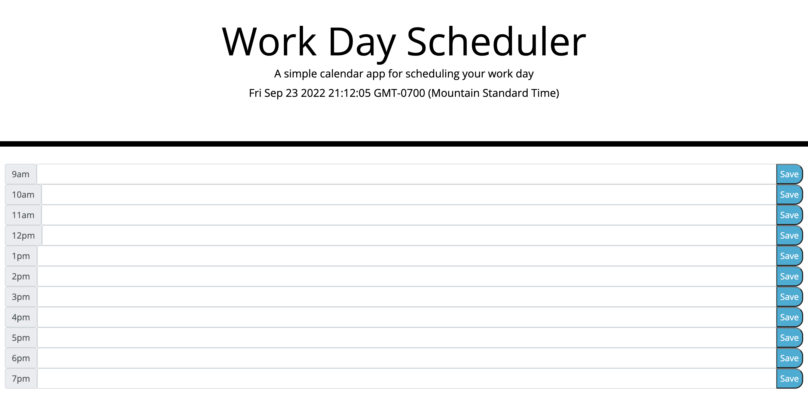

# Work-Day-Schedule

## Description

If the user wants a quick and easy way to keep track of their busy schedules day to day than they could use the Work Day Scheduler. Just put the text in the input space and save it.

## User Story

As a user I want to be able to keep track of my busy day hour to hour.

## Mock Up

## Project Link
